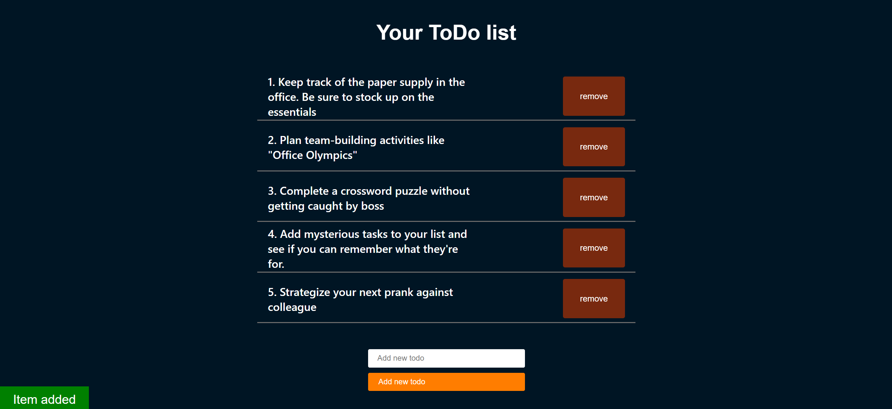

This is README file for my project.

To-Do List Web Application:
This project aims to provide users with a simple and intuitive platform for managing their tasks efficiently.

Features:
Task Management: Add, edit, and remove tasks easily.
Responsive Design: Seamlessly adapt to various screen sizes, ensuring a consistent user experience across devices.
Real-time Updates: Instantly reflect changes to the task list without the need for page refresh.
User-Friendly Interface: Intuitive UI elements make task management a breeze for users of all skill levels.

Technologies Used:
HTML: Structure the content of the web application.
CSS: Style the user interface for an appealing look and feel.
JavaScript: Implement interactive features and handle dynamic content.
Fetch API: Communicate with the backend server to fetch and update task data.